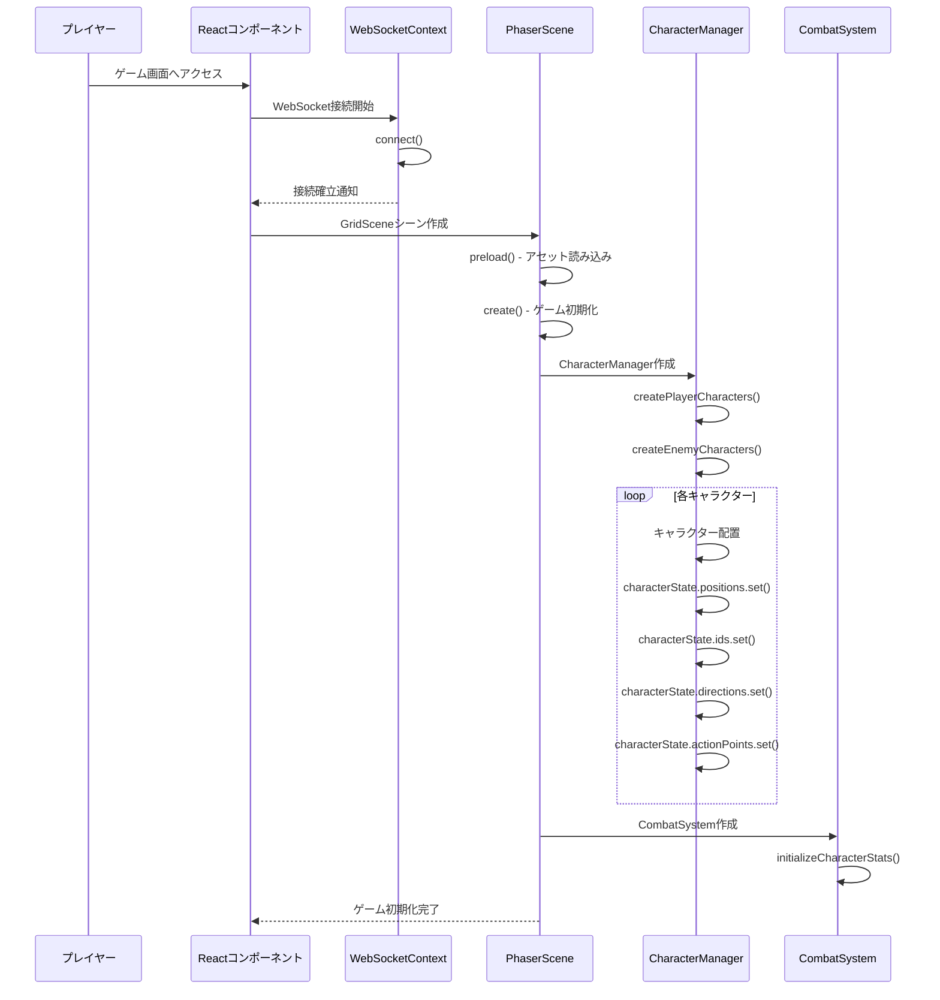
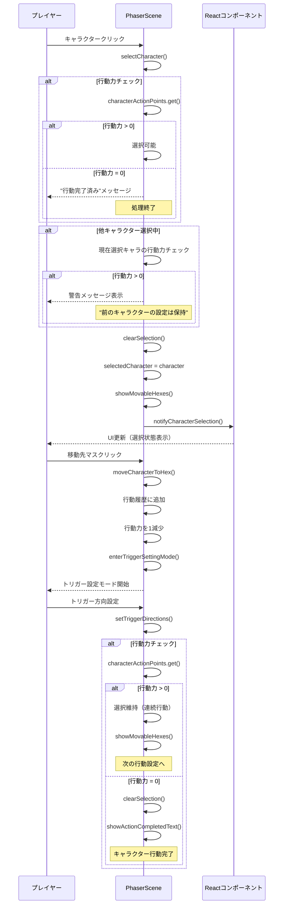
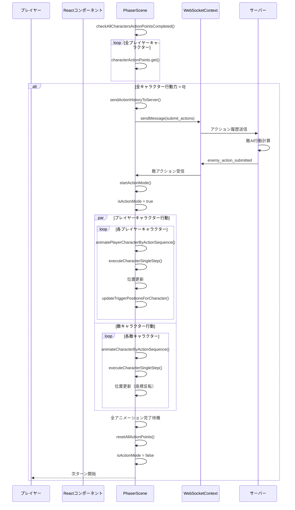
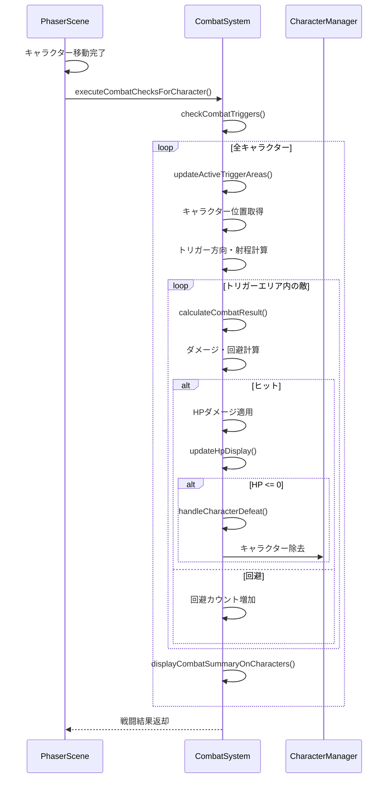
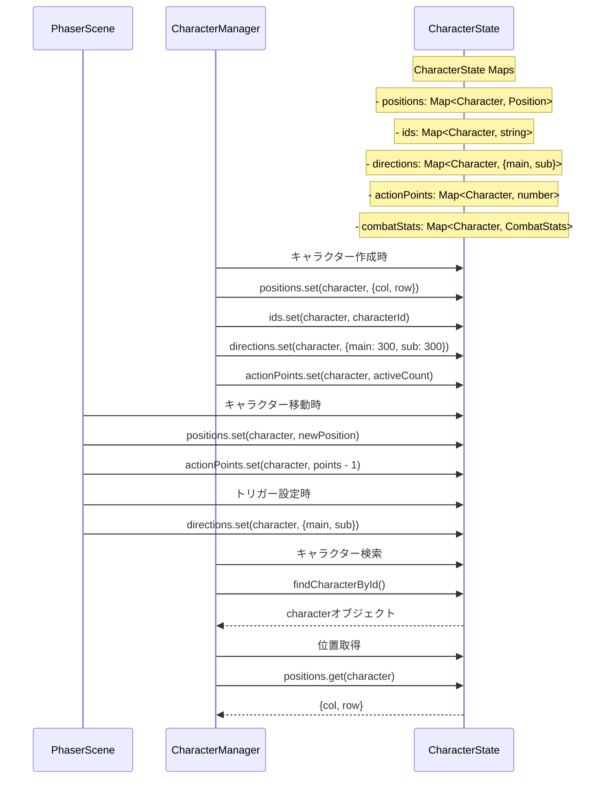
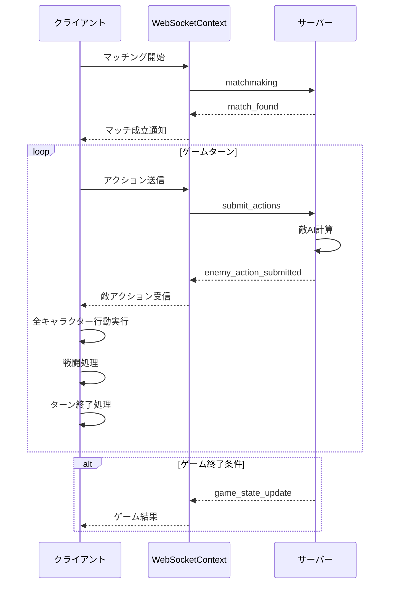

# ゲームステート管理・キャラクター位置管理・進行シーケンス図

現在のTriggerAppのゲームステート管理とキャラクターの位置管理、ゲームの進行に着目したシーケンス図を以下に示します。

## 1. ゲーム初期化シーケンス

## 2. キャラクター選択・行動設定シーケンス

## 3. 全キャラクター行動完了・ターン実行シーケンス

## 4. 戦闘システム・ステート更新シーケンス

## 5. キャラクター状態管理の詳細

## 6. WebSocket通信・ゲーム進行管理

## 主要なステート管理ポイント

### 1. キャラクター状態管理
- **CharacterState**: 全キャラクターの位置、ID、方向、行動力を一元管理
- **CombatSystem**: HP、戦闘統計、スタン状態を管理
- **位置同期**: 移動時にpositionsマップを即座に更新

### 2. ゲーム進行制御
- **行動力管理**: 各キャラクターの残り行動数を追跡
- **ターン制御**: 全キャラクター行動完了で次ターンへ
- **モード切替**: 設定モード ↔ 行動モード の状態管理

### 3. 非同期処理とアニメーション
- **並列アニメーション**: プレイヤー・敵キャラクターの同時行動
- **リアルタイム更新**: 移動中のトリガー表示追従
- **戦闘タイミング**: 各キャラクター移動完了時に戦闘判定

### 4. WebSocket状態同期
- **接続状態管理**: connecting/connected/disconnected
- **メッセージキュー**: アクション履歴の蓄積と一括送信
- **エラーハンドリング**: 接続失敗時の再接続制御

このシーケンス図は、現在のゲームの複雑なステート管理と、リアルタイム通信を含むゲーム進行の詳細な流れを示しています。
