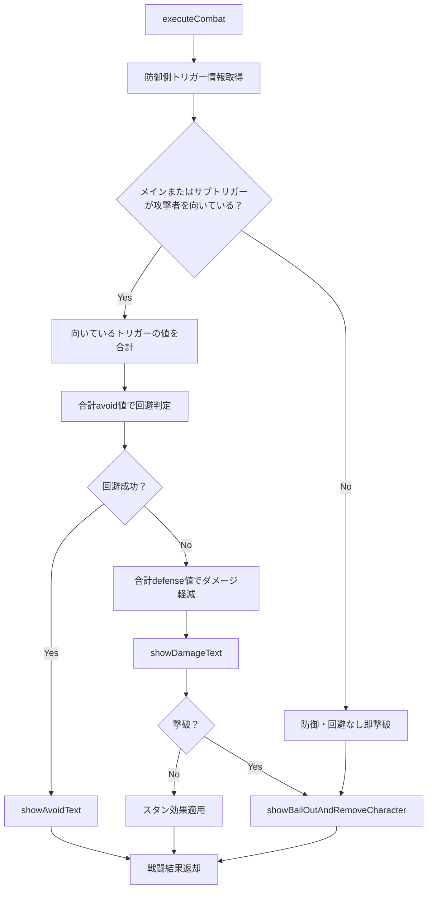

戦闘システムフローの修正を行います。現在のCombatSystemの実装を確認して、防御側のトリガー判定ロジックを変更します。 現在の戦闘実行ロジックを確認しました。次に、防御側のトリガー統計を取得する方法を詳しく見てみましょう。 現在の実装では、メインかサブのどちらか一つのトリガーしか使用していません。ユーザーの要求に合わせて、以下の変更を行います：

1. 両方のトリガーが攻撃者を向いているかを判定
2. 向いているトリガーのavoid値を合計して回避判定に使用
3. 同様に、防御値も合計して使用

## 修正した戦闘システムフロー

### 主な変更点：

1. **新しい分岐ロジック**：
   - `isDefenderFacingAttacker` → `hasTriggerFacing`（メインまたはサブトリガーが攻撃者を向いているか）

2. **トリガー合計システム**：
   - `getDefenderTriggerInfo()`: 両方のトリガーの向き状況を判定
   - `getDefenderTriggerStats()`: 向いているトリガーのavoid/defense値を合計

3. **詳細ログ**：
   - どのトリガーが向いているかを表示
   - 合計回避値と回避成功/失敗を表示

### 新しいフロー：

### 具体的な改善：

- **両トリガー対応**: メインとサブ両方が攻撃者を向いている場合、それぞれのavoid値が加算される
- **正確な角度判定**: 実際のトリガーの角度（TRIGGER_STATUS）を使用した扇形判定
- **半径無限大**: 距離チェックなし、角度のみで判定（ユーザー要求通り）
- **詳細ログ**: デバッグ用の詳細な情報表示

この修正により、防御側のトリガー設定がより戦略的に重要になり、両方のトリガーを適切に配置することで防御力を向上させることができます。